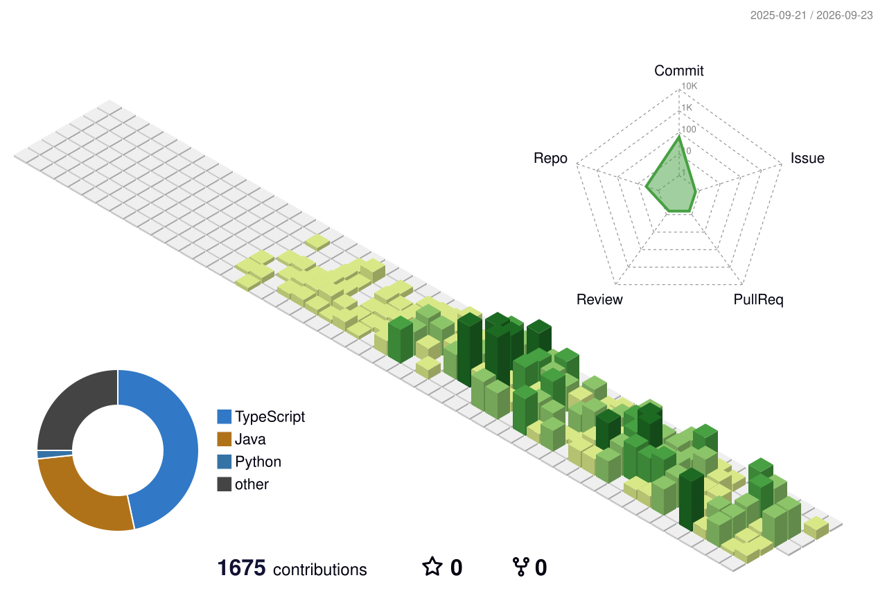

 

### 🧭 About

라라르떼(Rararete)에서 사내 ERP와 서버 인프라를 직접 설계·운영하는 개발자입니다.
백엔드부터 배포 파이프라인까지, 시스템이 도는 전체 흐름을 만드는 걸 좋아합니다.

- 🏗️ **ERP 리빌딩** — Blazor 기반 사내 시스템, 채널(네이버/CJ대한통운) 연동 작업
- 🔧 **인프라 운영** — Ubuntu 서버, nginx 리버스 프록시, 배포 자동화 직접 관리
- 🧪 **사이드 프로젝트** — Claude ↔ GPT 자동 코드 리뷰 시스템 (Spring Boot + React)

 

### 🚀 진행 중인 프로젝트

- ⚙️ **ERP 마이그레이션** — Blazor/.NET/EF Core → Spring Boot/JPA, 네이버·쿠팡·신세계몰 채널 연동까지 4단계 로드맵으로 진행 중
- 📦 **네이버 커머스 자동화** — Smart Store 주문 수집 + CJ대한통운 송장 자동 발급 (Java, PDF·바코드 라벨 생성)
- 💼 **개발자 포트폴리오** — Next.js + Tailwind, Claude ↔ GPT 코드 리뷰 시스템을 케이스 스터디로 담는 중 → [im-hansub.co.kr](https://im-hansub.co.kr)
- 📱 **라라르떼 Android 앱** — Kotlin + Jetpack Compose

 

### 🧱 Stack

 

### 📊 Stats

 

### 🌆 3D Contribution

 

